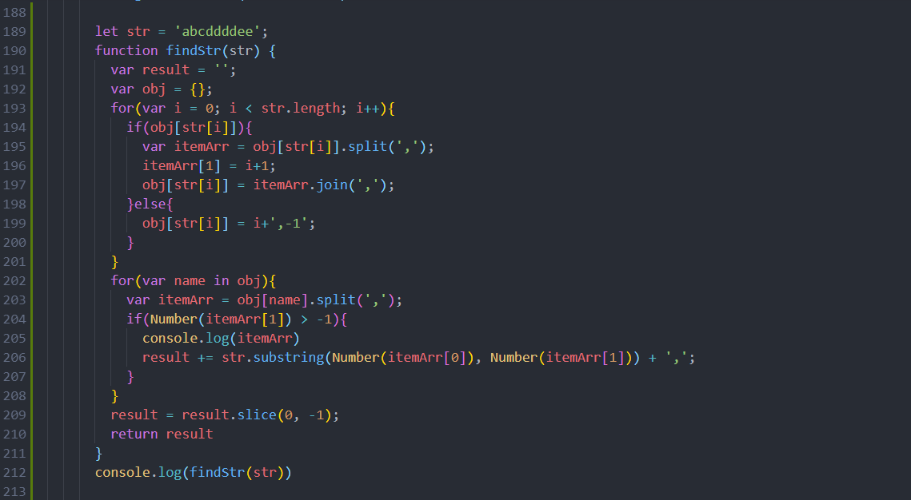

```JavaScript
   var arr = 'addddovvfffleevoooo'.split('');
      var res = '';
      var flag = [];
      arr.forEach((e, i) => {
        if (e == arr[i + 1]) {
          if (!flag.includes(e)) res += `,${e}`;
          flag.push(e);
          res += e;
        }
      })
      console.log(res.substr(1))
```
