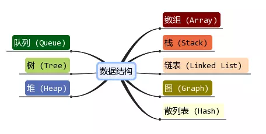

## 数据结构
> 《数据结构、算法与应用》：数据结构是数据对象，以及存在于该对象的实例和 组成实例的数据元素之间的各种联系。这些联系可以通过定义相关的函数来给出。

>  中文维基百科：数据结构（data structure）是计算机中存储、组织数据的方式。通常情况下，精心选择的数据结构可以 带来最优效率的算法。

### 常见的数据结构：

不同数据结构----不同操作性能

- 有的查询性能很快,有的插入速度很快,有的是插入头和尾速度很快
- 有的做范围查找很快,有的允许元素重复,有的不允许重复等等
- 在开发中如何选择,要根据具体的需求来选择

## 算法

- 一个有限指令集, 每条指令的描述不依赖于语言
- 接受一些输入（有些情况下不需要输入）
- 产生输出
- 一定在有限步骤之后终止

即算法就是解决问题的办法/步骤逻辑.，数据结构的实现, 离不开算法
