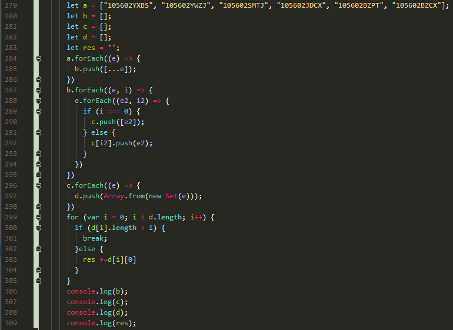
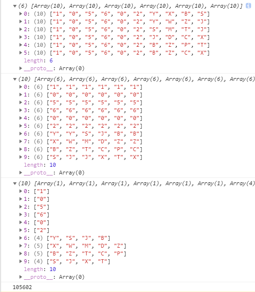

["105602YXBS", "105602YWZJ", "105602SMTJ", "105602JDCX", "105602BZPT", "105602BZCX"]

期望输出： 105602




```
let a = ["105602YXBS", "105602YWZJ", "105602SMTJ", "105602JDCX", "105602BZPT", "105602BZCX"];
let b = [];
let c = [];
let d = [];
let res = '';
a.forEach((e) => {
  b.push([...e]);
})
b.forEach((e, i) => {
  e.forEach((e2, i2) => {
    if (i === 0) {
      c.push([e2]);
    } else {
      c[i2].push(e2);
    }
  })
})
c.forEach((e) => {
  d.push(Array.from(new Set(e)));
})
for (var i = 0; i < d.length; i++) {
  if (d[i].length > 1) {
    break;
  }else {
    res +=d[i][0]
  }
}
console.log(b);
console.log(c);
console.log(d);
console.log(res);

```
