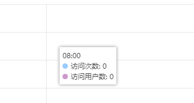

```$xslt
tooltip: {
    trigger: 'axis',
    axisPointer: {
        type: 'line',
        lineStyle: {
            width: 1,
            color: '#e7e7e7'
        }
    },
    backgroundColor: '#fff',
    confine: true,
    textStyle: {
        fontSize: 12,
        color: '#444'
    },
    padding: 5,
    extraCssText: 'box-shadow:-2px 0 6px rgba(180, 180, 180, 0.5),0 -2px 6px rgba(180, 180, 180,    	     0.5),0 2px 6px rgba(180, 180, 180, 0.5),2px 0 6px rgba(180, 180, 180, 0.5);border-radius: 1px;'
},
```
