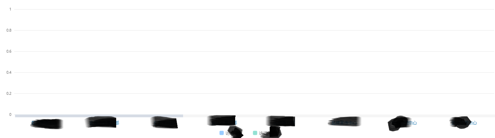

```$xslt
dataZoom: [
    {
        type: 'slider',
        show: true,
        xAxisIndex: [0],
        start: 0,
        end: 700 / this.orgVisitedChartxAxis.length,
        show: this.orgVisitedChartxAxis.length < 10 ? false : true,
        bottom:52,
        zoomLock: true,
        height: 8,
        showDetail:false,
        borderColor: 'transparent',
        backgroundColor: '#f5f5f5',
        dataBackground:{
            lineStyle:{
                opacity:0,
            },
            areaStyle:{
                opacity:0,
            }
        },
        handleSize: 0,
        handleStyle: {
            shadowBlur: 6,
            shadowOffsetX: 1,
            shadowOffsetY: 2,
            shadowColor: '#f8f8f8'
        }
    },
    {
        type: 'inside',
        xAxisIndex: [0],
        start: 0,
        end: 700 / this.orgVisitedChartxAxis.length,
        zoomLock: true
    }
]
```
