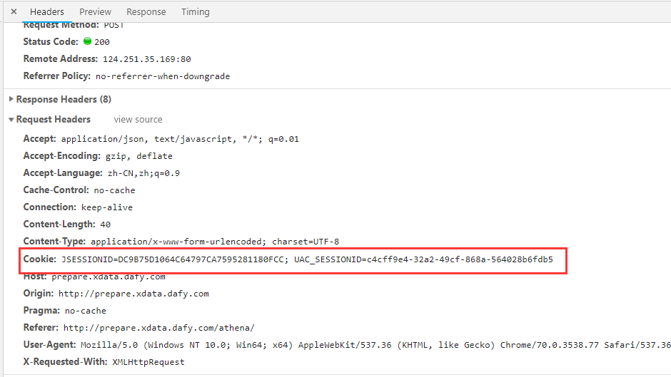

> sessionid 是一个会话的 key，浏览器第一次访问服务器，服务器创建一个 session 对象，同时生成一个 sessionId。

> tomcat 生成的 sessionid 叫做 jsessionid。

> session 在访问 tomcat 服务器 HttpServletRequest 的 getSession(true) 的时候创建，tomcat 的 ManagerBase 类提供创建 sessionid 的方法：随机数 + 时间 + jvmid。

> tomcat 的 StandardManager 类将 session 存储在内存中，也可以持久化到file，数据库，memcache，redis等。

> 客户端只保存 sessionid 到 cookie 中，而不会保存 session，session 销毁只能通过 invalidate 或超时，关掉浏览器并不会关闭 session。

> 服务器初次创建 sessionid 的时候后返回 sessionid 到客服端，在返回头 response 中有 setCookie：

> 浏览器会把 sessionname -> sessionid 存到 cooike 中，同 path 下再次请求服务器时，会自动在请求头中带上 cooike 信息，服务器可以在 _COOKIE 中得取到想要的 session：

> 当程序需要为某个客户端的请求创建一个session时，服务器首先检查这个客户端的请求里是否已包含了一个session标识------------称为session id，
如果已包含则说明以前已经为此客户端创建过session，服务器就按照session id把这个session检索出来使用（检索不到，会新建一个）。
如果客户端请求不包含session id，则为此客户端创建一个session并且生成一个与此session相关联的session id，
session id的值应该是一个既不会重复，又不容易被找到规律以仿造的字符串，这个session id将被在本次响应中返回给客户端保存。
