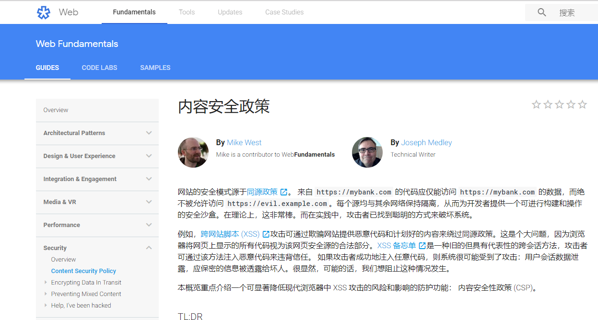
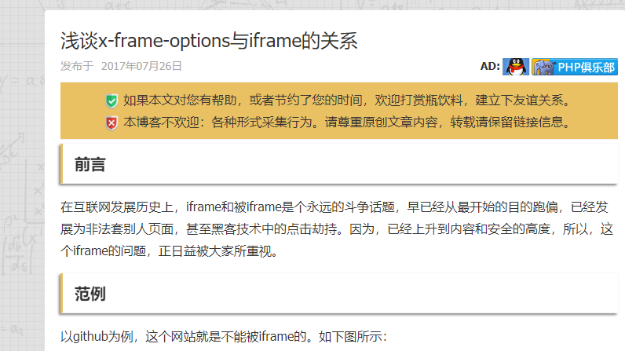
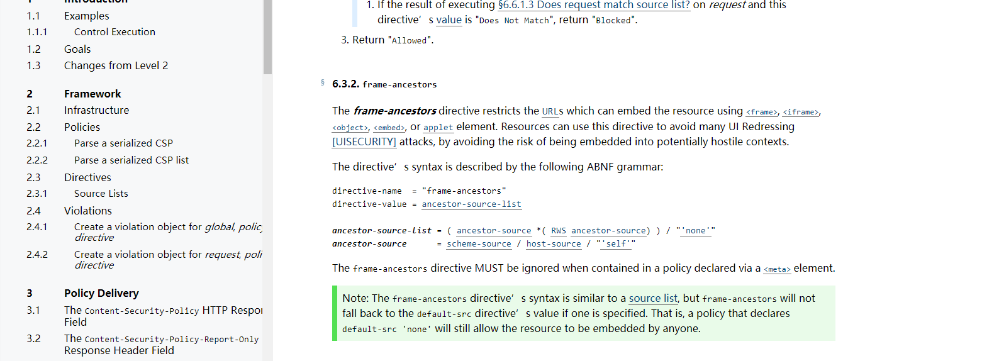
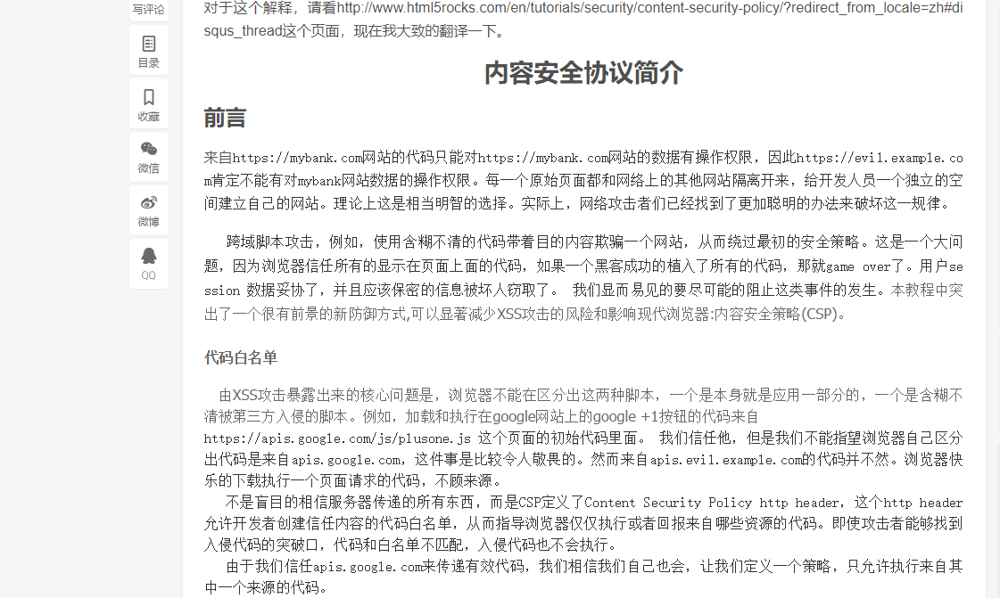
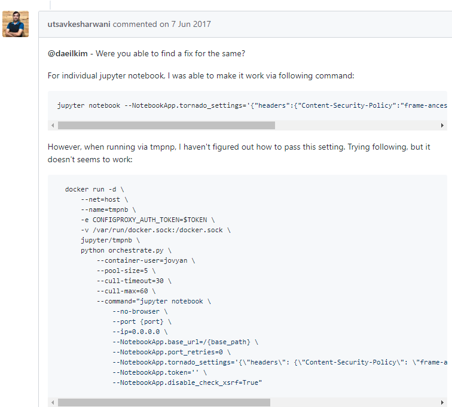
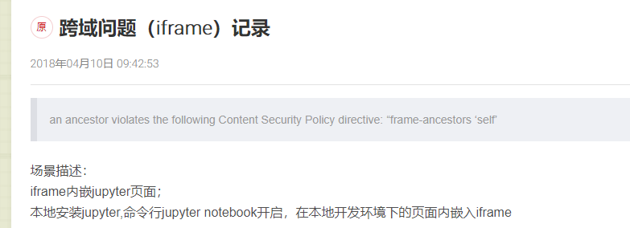

> CSP：开发者可以创建并强制应用一些规则，管理网站允许加载的内容。简单来说，就是我们能够规定，我们的网站只接受我们指定的请求资源。

> 意义：防XSS等攻击（跨站脚本攻击），CSP 的实质就是白名单制度，开发者明确告诉客户端，哪些外部资源可以加载和执行，等同于提供白名单。它的实现和执行全部由浏览器完成，开发者只需提供配置。

原文：

[https://developers.google.com/web/fundamentals/security/csp/?hl=zh-cn](https://developers.google.com/web/fundamentals/security/csp/?hl=zh-cn)

[https://newsn.net/say/x-frame-options-and-iframe.html](https://newsn.net/say/x-frame-options-and-iframe.html)

[https://w3c.github.io/webappsec-csp/#directive-frame-ancestors](https://w3c.github.io/webappsec-csp/#directive-frame-ancestors)

[https://blog.csdn.net/fengdetiankong/article/details/50923663](https://blog.csdn.net/fengdetiankong/article/details/50923663)

[https://github.com/jupyter/tmpnb/issues/263	](https://github.com/jupyter/tmpnb/issues/263	)

[https://blog.csdn.net/xixi880928/article/details/79876381](https://blog.csdn.net/xixi880928/article/details/79876381)

