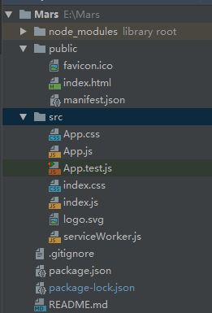
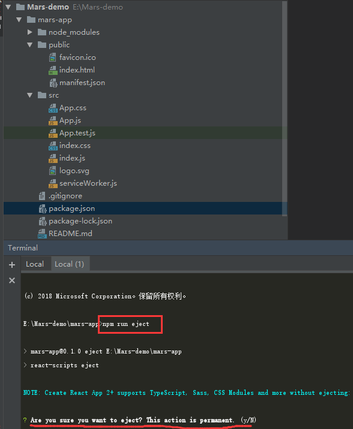
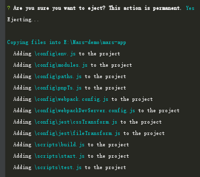
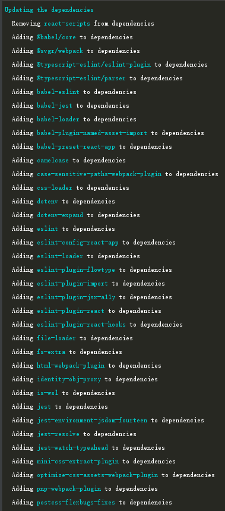
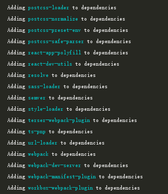
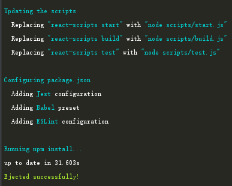
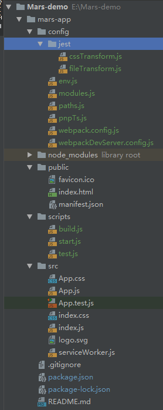

>用 React 创建新的单页应用的最佳方式：Create React App

>Node >= 6，npm >= 5.2

```$xslt
npm create-react-app my-app
cd my-app
npm start
```
#### 项目初始化后结构如下：


- 项目目录中public和src目录下的index文件必须存在不能改名，其他的文件可删除和改名；
- 只有在src根目录下的文件会被webpack编译；
- 只用public目录下的文件才会被public/index.html引用

#### 脚本命令
- npm start：在http://localhost:3000下监视文件，文件修改将自动更新；
- npm test：启动测试运行程序；
- npm run build：打包编译；
- npm run eject：导出可配置的模板，可自定义修改配置，已上传项目Mars-eject。


##### npm run eject 前




##### npm run eject 中







##### npm run eject 后




*参考文章：https://www.cnblogs.com/axl234/p/8328612.html*

**待分析：create-react-app的使用及原理**
