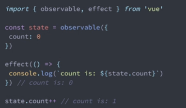
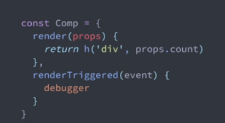
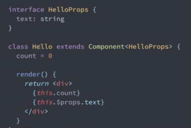
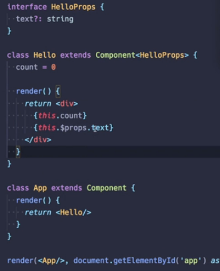

### 1.更快

**vue是Virtual DOM渲染机制，3.0版本对Virtual DOM进行重构**。结合模板编译提高运行性能，
初始化渲染更新提速翻倍，以更多编译时优化减少运行时开销，
Virtual DOM有时不可避免重新生成节点，通过更多的分析在编译阶段进行压榨以此提高性能。

**减少运行时开销**。vue将模板传入Virtual DOM的渲染函数时，2.0无论原生html标签或者组件，
都是作为字符串被传入一个用来创建虚拟node的函数中，
在检查一个元素是原生html还是组件时是在运行时做的，此时会有一定的运行时开销，
而这个开销是可以在编译时来判断的，若直接是html就在编译时生成Virtual DOM代码，
就是所谓的component fast path。若是组件则直接生成相应的组件代码，减少运行时开销。

**跳过不必要的条件判断；生成更易于js引擎优化的代码**。尽可能的使用monomorphic calls，
也就是说在生成虚拟节点的时候尽可能的函数调用形状一直，所有函数有相同的参数，从底层的一些优化的技巧，
生成更易于js引擎优化的代码。同时在模板中进行静态分析，添加标记信息，跳过一些不必要的判断。


### 2、优化slots的生成

**确保精确的组件级别的依赖收集；避免不必要的父子关联更新。**

当通过slots把内容传入子组件的时候，每次内容更新，先要更新父组件，
父组件更新的同时生成新的slot内容传入子组件，然后子组件也更新，这就是父子关联更新。

在新的机制里面，把所有的slots都和scope-slots一样，同时生成了一个函数，当把函数传入子组件的时候，
由函数决定什么时候调用这个函数，当子组件调用这个函数的时候，这个函数里面的依赖就成了子组件的而不是父组件的，
当插槽内容变动的时候，只需要重新渲染子组件，这样父子之间的更新检测就分开了，不存在组件过度重绘的问题。


### 3、静态内容提取

**跳过整块静态内容的更新；即使静态内容在列表中被重复也可以生效。**

2.0就有，检测到一部分模板是不会变的，在更新的时候就直接复用之前的vitrual DOM
比对的过程就直接跳过。

2中没有的是当一个元素的任意深度包含任意动态内容时，那这个元素就无法被静态化，
这部分还是可以优化的，如果一个元素身上所有的属性都是静态的，可以把整个属性对象都提取出来，
每次比对元素时，就可以跳过，直接取比对他的children。


### 4、内联事件函数提取

**避免每次渲染生效新的函数而导致不必要的子组件更新。**

```<comp @event="a++">```这种写法每次都会生成新的函数（内联函数），每一次生成的函数和之前
生成的都是不一样的函数，虽然做的事情不一样，单js无法区分，为了安全其件每一次都会重新渲染。
3.0每一次生成就把他给catch了，这样就避免子组件无谓的更新。


### 5、基于proxy的新数据监听系统，全语言特性支持+更好的性能

 包含对象属性的增加删除、数组index、length更改、以及Map，Set，Weakmap，WeakSet和Classes。
 
 2.0是基于ES5的object.defineProperty的API
 
 新数据监听系统在应用初始化的时候监听大规模数据的时候性能也会得到提升，
 基于proxy的监听是只有当数据被用到的时候才会监听他，
 如果有一个非常庞大的数据，只有一小部分才用到，则只监听这一小部分。


### 6、利用proxy减少组件实例初始化开销

每一个vue组件都会代理他所包含的data，computed以及props等，
这些代理都是通过object.defineProperty来实现的，这个是相对昂贵的操作。

在3.0里面，vue暴露给使用者的this其实是一个真正的组件实例的一个proxy，
当从这个this上获取属性的时候vue内部再做判断，这样就避免了object.defineProperty使用，
对组件实力初始化得到了提升。

最终：渲染3000个袋状态的组件实力，版本2.5.18-----3.0，仅做这些和api无关的改动，速度加倍 内存占用减半


### 7、 更小

**代码结构和tree-shaking结合**，最后编译的时候把没有用到的代码给扔掉，之前vue里面所有的东西都加在Vue上，
一引入vue所有方法就一套都来了。


### 8、更易于维护
更多是针对于vue的开发团队，开发vue 从flow迁移到typeScript，用typeScript重写了，typeScript，对于社区支持好很多。


### 9、内部模块解耦
降低源码阅读难度，类型信息更易于解读源码，内部模块清晰解耦。让更多人更容易参与到开发中来。


### 10、编译器重构 

之前很多内部的编译逻辑如v-if都是写死的，3.0希望有一个插件化的机制，把这写一个个指令都单独写成一个一个解耦的小插件，更易于用户阅读。

编译器希望能给提供出一个带位置信息的parser['pɑ:sə]，这样就可以生成soruce map，如果在渲染中有runtime的错误就可以指出在模板中出错的地方。


### 11、更好的多端渲染功能

weex 、native vue、wepy

2.0代码虽然可以做到，倒要fork源码来实现。

3.0中 import {createRenderer} from ‘@vue/runtime-core’  包含了各种组件以及Virtual DOM的算法等，用vue管理其他维护。


### 12、暴露新的API
observable显示的创建一个响应式的对象；[əbˈzɜ:vəbl]

effect注册依赖；

之后这个对象被改动，这个effect会重新再执行一遍。

可以使用这个轻松实现跨足间之间的状态共享。




### 13、更轻松的排查组件组件之间的触发原因

内置renderTriggered方法，在里面打debugger，会在浏览器中清楚地看见是哪一行出发了组件的更新，参数event提供了具体的信息



### 14、更好的typeScript支持，包括原生的class API和TSX

不需要依赖vue class component这个库了，可以像下面这个创建组件：





### 15、更好的警告信息

组件堆栈包含函数式组件；

可以直接在警告中查看组件的props；

在更多的警告中提供组件堆栈信息。


### 15、experimental Hooks API    

作为一种逻辑复用机制，大概率取代mixins

react 提出的react hooks 的实现其实和react没有直接的关联，在任何框架可以直接用，

hooks作为一逻辑的重用机制，玩爆mixins，vue也将提供的这种机制，具体api还在研究，
为了更贴合vue用户的使用习惯，不会直接使用react hooks，在 gitHub有 vue hooks项目。
[ɪkˌsperɪˈmentl]

### 16、experimental  TIme slicing Support

react前时间提出的概念:concurrent React，让框架在进行js计算的时候切成一帧一帧的进行，[kənˈkʌrənt]

作为框架最容易导致的性能问题是担忧浏览器的主线程里面进行大量的js操作，会使得整个主线程被block，
被block的时候浏览器其实是处在一个没有响应的状态，如果用户的某个操作导致大量的js计算，同时用户还在继续操作的话，
就会导致大量的计算被重复不断的推进来，性能下降，

可以通过没16ms就yeild给浏览器的操作，每隔一段时间让新的事件重新进来，然后之前的就会被invalid不去做。这样就会大大降低性能的消耗。


### 17、关于IE

会有一个专门的版本，在IE11，3.0中对于IE11不支持的用法给与警告，不能使用。
