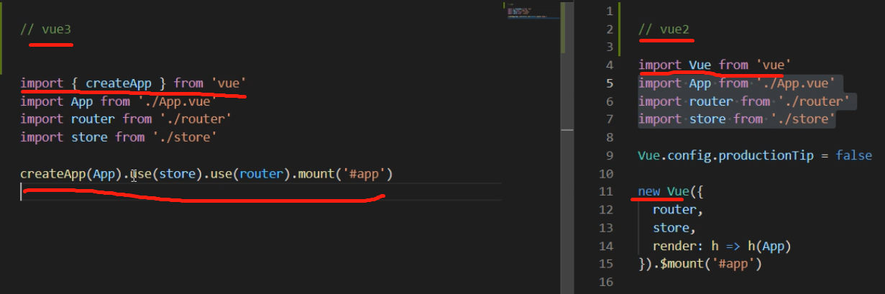
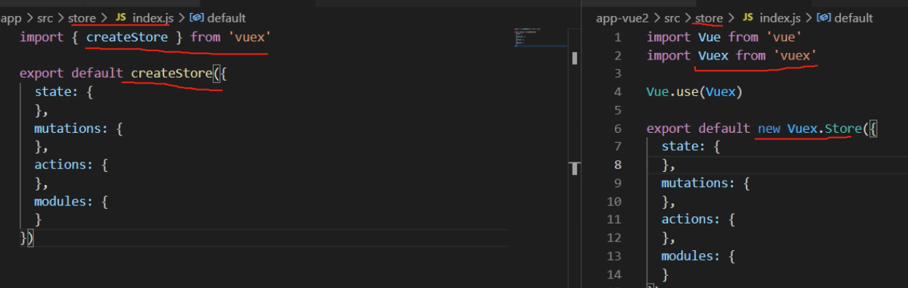
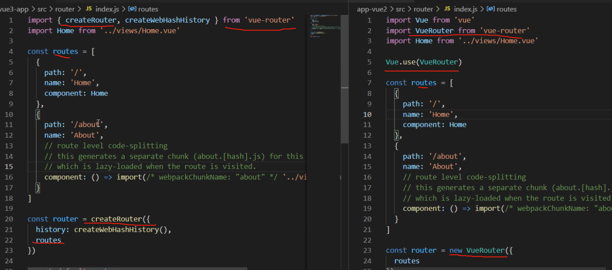
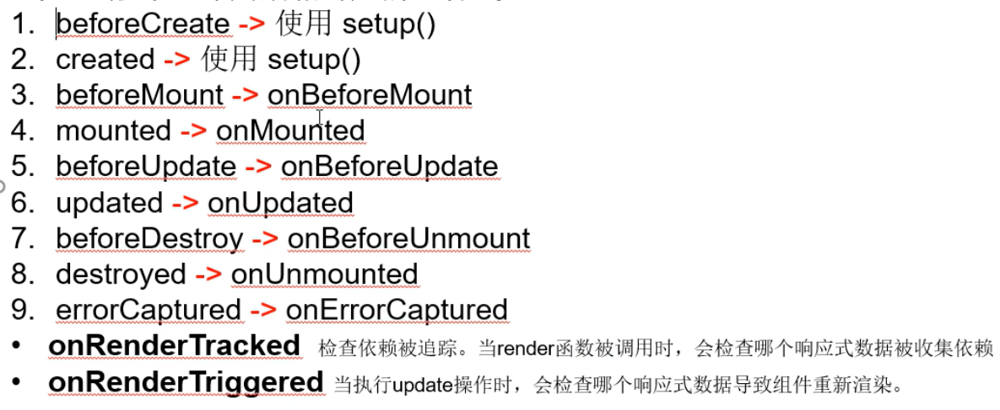
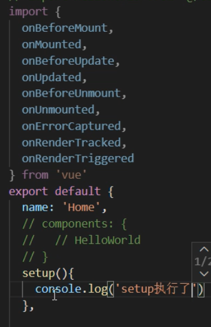
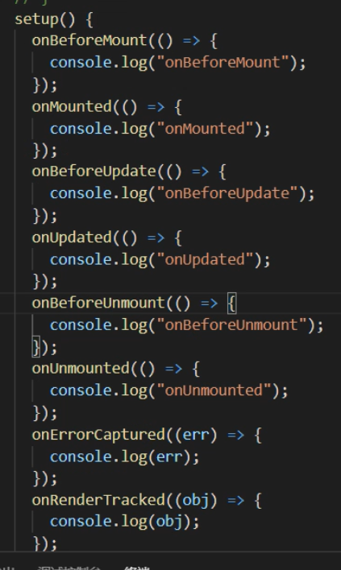
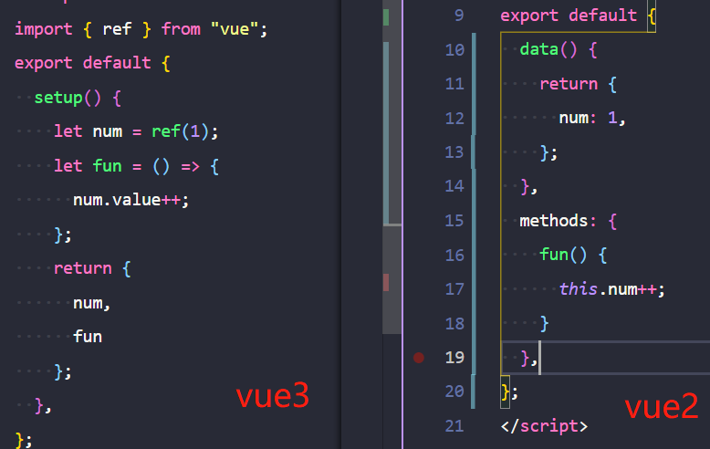
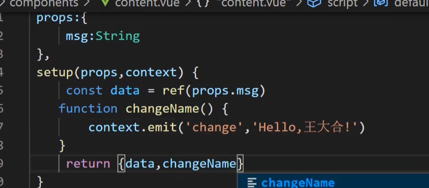
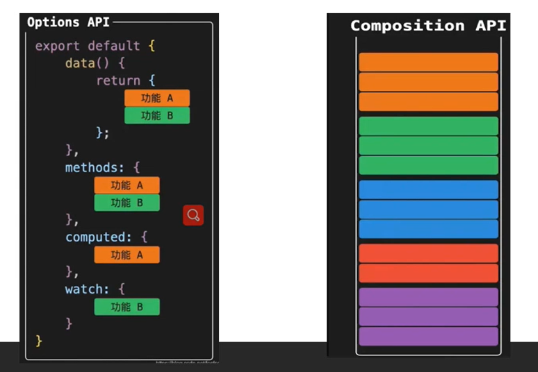

<!-- created by mayingying on 2021.04.05 -->
# vue3

1、与 vue2 的 main.js 对比

2、与 vue2 的 store 对比

3、与 vue2 的 router 对比

4、与 vue2 生命周期相对应的组合式 api

- 简介

- 引入

- 执行顺序

5、声明响应式数据

- 在 setup 函数中 return 出来的数据即为声明的数据
- 用 ref 或者 reactive 包裹的数据为响应式的，为此开发者可以自行定义那些数据是需要响应式的，哪些数据不需要，提高程序效率
- 在 setup 中 this 为 undefined
- ref 包裹实现原理
.png)
- ref 包裹将简单类型数据变成响应式数据，在 js 中通过.value获取值，在模板中不需要（内部解析会自动获取）
- reactive 包裹将复杂类型数据变成响应式数据，深度响应式
- props 与 context

## 优势

- 更易维护：composition-api，比如在同一个方法中完成同一个需求的所有功能
